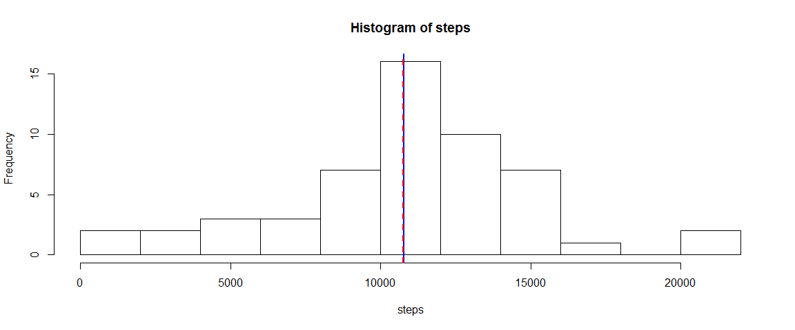
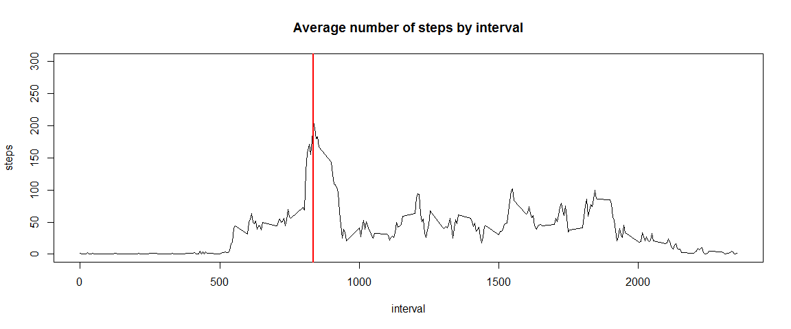
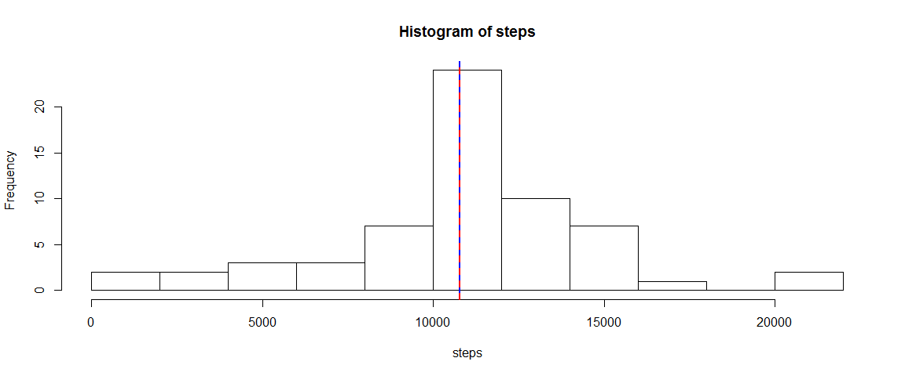
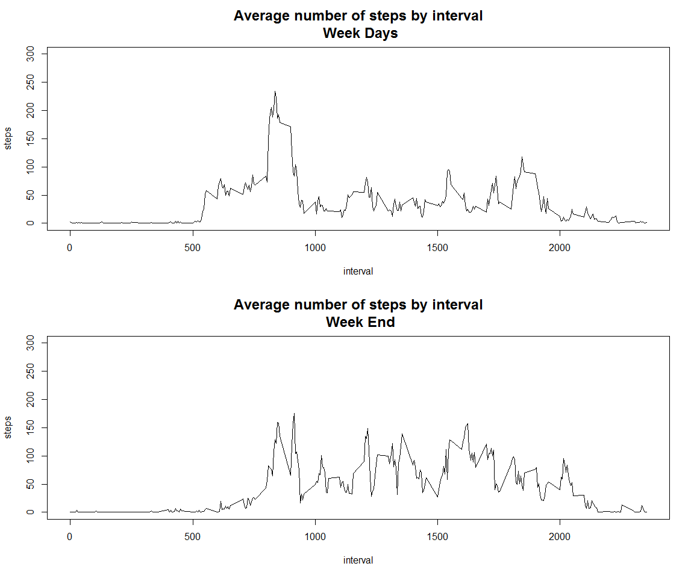

# Pear Assessment 1 for reproducible Research
S. Brugere  
10 mai 2017  


  
## Loading and preprocessing the data

```r
if (! file.exists("activity.csv")) unzip("activity.zip")
data <- read.csv("activity.csv", header=T, sep=",")
```
  
  
## What is mean total number of steps taken per day?

```r
par(mfrow=c(1,1))
totalByDay <- aggregate(steps~date,data=data,FUN="sum")
with(totalByDay, hist(steps,breaks=12))
abline(v = mean(totalByDay$steps, na.rm=T), col = "blue", lwd=2)
abline(v = median(totalByDay$steps), col ="red", lwd=2, lty=2)
```

<!-- -->
  
The mean total number of steps taken per day is 10766.  
The median total number of steps taken per day is 10765.  
  
## What is the average daily activity pattern?

```r
means <- aggregate(steps~interval, data = data, FUN = "mean", na.rm = TRUE)
plot(steps~interval, data = means, type="l", main="Average number of steps by interval",ylim=c(0,300))
abline(v = means[which.max(means$steps),1], col = "red", lwd = 2)
```

<!-- -->
  
The interval which corresponds to the max average number of steps is 835.  
    
## Imputing missing values

```r
cnt <- sum(is.na(data$steps))
```
The number of missing values is 2304.  


```r
data2 <- transform(data, steps = ifelse(is.na(steps), means[,2], data[,1]))
totalByDay <- aggregate(steps~date, data=data2,FUN="sum")
with(totalByDay, hist(steps,12))
abline(v = mean(totalByDay$steps, na.rm=T), col = "blue", lwd=2)
abline(v = median(totalByDay$steps), col ="red", lwd=2, lty=2)
```

<!-- -->
The strategy with missing values is to replace NA values with the average of the interval.
The only difference with the first histogram is the frequency of the interval of the mean value?  
  
## Are there differences in activity patterns between weekdays and weekends?

```r
data3 <- transform(data, typeOfDay = 
    ifelse(weekdays(as.Date(data$date,"%Y-%m-%d")) %in% c("samedi","dimanche"), "weekend", "weekday"))
means <- aggregate(steps~interval+typeOfDay, data = data3, FUN = "mean", na.rm = TRUE)
par(mfrow=c(2,1))
plot(steps~interval, data = means[means$typeOfDay=="weekday",], type = "l", 
     main="Average number of steps by interval\n Week Days", cex.main = 1.5, ylim=c(0,300))
plot(steps~interval, data = means[means$typeOfDay=="weekend",], type = "l", 
     main="Average number of steps by interval\n Week End", cex.main= 1.5, ylim=c(0,300))
```

<!-- -->
